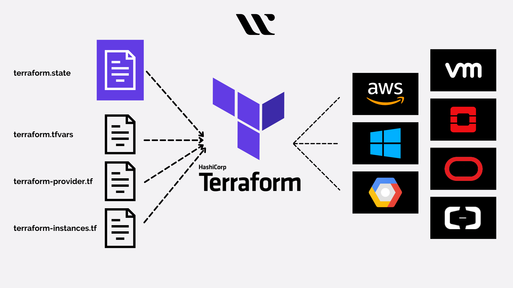

# IAC with Terraform 


## What is Terraform 
- Terraform is an open-source infrastructure as code software tool. 

- It is a tool for building, changing and versioning infrastructure safely and efficiently. 

- Terraform enables developers to use a high-level configuration language called HCL (HashiCorp Configuration Language) to describe the desired “end-state”

- Terraform files are created with a .tf extention

- Terraform allows for rapid create of instances using AMIs

## Why Terraform
There are a few key reasons developers choose to use Terraform over other Infrastructure as Code tools:

1. **Open source**: Terraform is backed by large communities of contributors who build plugins to the platform. 

2. **Platform agnostic**: Meaning you can use it with any cloud services provider. Most other IaC tools are designed to work with single cloud provider.

3. **Immutable infrastructure**: Terraform provisions immutable infrastructure, which means that with each change to the environment, the current configuration is replaced with a new one that accounts for the change, and the infrastructure is reprovisioned. Even better, previous configurations can be retained as versions to enable rollbacks if necessary or desired.



## Terraform Installation 

- [Manual installation of terraform](https://www.terraform.io/downloads.html)

- Linux installation:

1. The Terraform packages are signed using a private key controlled by HashiCorp, so in most situations the first step would be to configure your system to trust that HashiCorp key for package authentication. For example:

```
curl -fsSL https://apt.releases.hashicorp.com/gpg | sudo apt-key add -
```

2. After registering the key, you can add the official HashiCorp repository to your system:

```
sudo apt-add-repository "deb [arch=$(dpkg --print-architecture)] https://apt.releases.hashicorp.com $(lsb_release -cs) main"
```
3. To install Terraform from the new repository:

```
sudo apt install terraform
```