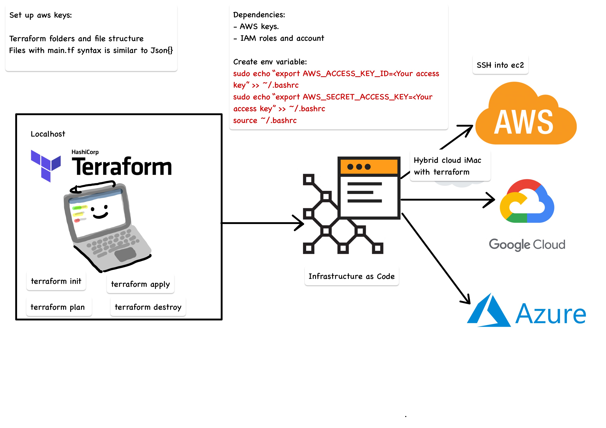

# IAC with Terraform 


IaC has two parts:
- Configuartion Mangement: 
  - They help configure and test machines to a specific state.
  - Systems - Puppet, Chef and ansible
- Orchestration:
  - These tools focus on networking and architecture rather than the configuration of individual machines. 
  - Terraform, Ansible

## What is Terraform 
- Terraform is an open-source infrastructure as code software tool. 

- It is a tool for building, changing and versioning infrastructure safely and efficiently. 

- Terraform enables developers to use a high-level configuration language called HCL (HashiCorp Configuration Language) to describe the desired “end-state”

- Terraform files are created with a .tf extention

- Terraform allows for rapid create of instances using AMIs

## Why Terraform
There are a few key reasons developers choose to use Terraform over other Infrastructure as Code tools:

1. **Open source**: Terraform is backed by large communities of contributors who build plugins to the platform. 

2. **Platform agnostic**: Meaning you can use it with any cloud services provider. Most other IaC tools are designed to work with single cloud provider.

3. **Immutable infrastructure**: Terraform provisions immutable infrastructure, which means that with each change to the environment, the current configuration is replaced with a new one that accounts for the change, and the infrastructure is reprovisioned. Even better, previous configurations can be retained as versions to enable rollbacks if necessary or desired.


## Terraform Installation 

- [Manual installation of terraform](https://www.terraform.io/downloads.html)

- Linux installation:

1. The Terraform packages are signed using a private key controlled by HashiCorp, so in most situations the first step would be to configure your system to trust that HashiCorp key for package authentication. For example:

```
curl -fsSL https://apt.releases.hashicorp.com/gpg | sudo apt-key add -
```

2. After registering the key, you can add the official HashiCorp repository to your system:

```
sudo apt-add-repository "deb [arch=$(dpkg --print-architecture)] https://apt.releases.hashicorp.com $(lsb_release -cs) main"
```
3. To install Terraform from the new repository:

```
sudo apt install terraform
```

## Terraform commands

- `terraform init`: Prepare your working directory for other commands
- `terraform validate`: Check whether the configuration is valid
- `terraform plan`: Show changes required by the current configuration
- `terraform apply`: Create or update infrastructure
- `terraform destroy`: Destroy previously-created infrastructure

## Creating a VPC using IaC Terraform



#### Step 1: Create env variable
For mac users, use the following command: 

```
 sudo echo "export AWS_ACCESS_KEY_ID=<Your access key>" >> ~/.bashrc
  sudo echo "export AWS_SECRET_ACCESS_KEY=<Your secret key>" >> ~/.bashrc
 source ~/.bashrc

```
#### Step 2: Set provider 

Let's build a script to connect to AWS and download/setup all dependencies required 

- Specify a cloud provider and region 

```
# define the region to launch the ec2 instance in Ireland
provider "aws" {
	region = "eu-west-1"
}

```

- Initialize terraform: `terraform init`

*There is no need to specify access/secret keys, Terraform will look for the keys stored as environment variables*

#### Step 3: Launch EC2 instance with Resources 

Resources are the most important element in the Terraform language

Each resource block describes one or more infrastructure objects, such as

- virtual networks
- compute instances
- higher-level components such as DNS records

A resource block declares a resource of a given type, and a given local name which can be used to refer to the resource from elsewhere in the same Terraform module

The resource type and name together serve as an identifier for a given resource and so must be unique within a module

```
resource "aws_instance" "app_instance"{
	# add the AMI id between "" as below
	ami = "ami-038d7b856fe7557b3"

	# Let's add the type of instance we would like launch
	instance_type = "t2.micro"

    # Need to enable public IP for our app
    associate_public_ip_address = true
   
    # Tags is to give name to our instance
    tags = {
        Name = "eng89_brittany_terraform"
    } 

    key_name = "brittany_aws"
}

```
- Now run `terraform plan` the `terraform apply`

#### Variables 
Here we will be setting all the variables needed to create the VPC. It is good practice as it uses **DRY**. 

 Variables can be defined in a separate file `variables.tf` and then referenced in the `main.tf` files using `var.resource_name`.

```
variable "aws_key_name" {
    default = "eng89_brittany"
}

variable "aws_key_path" {
    default = "~/.ssh/eng89_brittany.pem"
}

variable "region" {
    default = "eu-west -1"
}

variable "instance_type"{
    default = "t2.micro"
}

```

#### Creating a VPC using Terraform 


For detailed steps on how to configure the vpc follow this [link](https://github.com/brittanyharrison/aws_VPC/blob/main/README.md#creating-and-setting-up-vpc)

To configure your VPC, several resources are required:
- [IPv4 CIDRblock](https://github.com/brittanyharrison/aws_VPC#step-1-create-a-vpc)
- [Internet Gateway](https://github.com/brittanyharrison/aws_VPC#step-2-create-internet-gateway)
- [Subnet](https://github.com/brittanyharrison/aws_VPC#step-3-creating-a-subnet)
- [Route Table](https://github.com/brittanyharrison/aws_VPC#step-4-creating-a-route-table) 
- [Network ACL](https://github.com/brittanyharrison/aws_VPC/blob/main/README.md#step-4-creating-network-acl)
Inbound rules:

Outbound rules:

- [Security Groups](https://github.com/brittanyharrison/aws_VPC/blob/main/README.md#step-5-creating-security-groups)
Inbound rules:


**IPv4 CIDRblock:**
```
resource "aws_vpc" "eng89_brittany_vpc" {
  cidr_block = "10.104.0.0/16"
  instance_tenancy = "default"

  tags = {
      Name = "eng89_brittany_vpc"
  }
}
```
**Internet Gateway:**
```
resource "aws_internet_gateway" "eng89_brittany_igw" {
  vpc_id = aws_vpc.eng89_brittany_vpc.id

  tags = {
    Name = "eng89_brittany_igw"
  }
}
```
**Public Subnet:**
```
resource "aws_subnet" "eng89_brittany_subnet_public" {
  vpc_id     = aws_vpc.eng89_brittany_vpc.id
  cidr_block = "10.104.1.0/24"
  map_public_ip_on_launch = true
  availability_zone = "eu-west-1a"

  tags = {
    Name = "eng89_brittany_subnet_public"
  }
}
```
**Route Table:**
```
resource "aws_route_table" "eng89_brittany_rt" {
  vpc_id = aws_vpc.eng89_brittany_vpc.id

  route = [
    {
      cidr_block = "0.0.0.0/0"
      gateway_id = aws_internet_gateway.eng89_brittany_rt.id
    }
  ]

  tags = {
    Name = "eng89_brittany_rt"
  }
}
```

**Route table association:**
```
resource "aws_route_table_association" "eng89_brittany_subnet_assoc" {
  gateway_id     = aws_internet_gateway.foo.id
  route_table_id = aws_route_table.bar.id
  subnet_id = aws_subnet.foo.id
}
```
**Network ACL**
```
resource "aws_network_acl" "eng89_brittany_nacl_public" {
  vpc_id = aws_vpc.main.id

  ingress = [
    {
      protocol   = "tcp"
      rule_no    = 100
      action     = "allow"
      cidr_block = "0.0.0.0/0"
      from_port  = 80
      to_port    = 80
    }
  ]

  	ingress {
		protocol = "tcp"
		rule_no = 110
		action = "allow"
		cidr_block = "0.0.0.0/0"
		from_port = 443
		to_port = 443
	}

  	ingress 
    
    {
		protocol = "tcp"
		rule_no = 120
		action = "allow"
		cidr_block = "${var.my_ip}/32"
		from_port = 22
		to_port = 22
	}

    ingress {
		protocol = "tcp"
		rule_no = 130
		action = "allow"
		cidr_block = "0.0.0.0/0"
		from_port = 1024
		to_port = 65535
	}
	

  egress = [
    {
      protocol   = "tcp"
      rule_no    = 100
      action     = "allow"
      cidr_block = "0.0.0.0/0"
      from_port  = 80
      to_port    = 80
    }
  ]

  	egress {
		protocol = "tcp"
		rule_no = 130
		action = "allow"
		cidr_block = "0.0.0.0/0"
		from_port = 1024
		to_port = 65535
	}

	# allow 27017 to private subnet
	egress {
		protocol = "tcp"
		rule_no = 140
		action = "allow"
		cidr_block = "10.104.2.0/24"
		from_port = 27017
		to_port = 27017
	}


  tags = {
    Name = "eng89_brittany"
  }
}
```
**Security groups**
```
resource "aws_security_group" "allow_tls" {
  name        = "allow_tls"
  description = "Allow TLS inbound traffic"
  vpc_id      = aws_vpc.main.id

  ingress = [
    {
      description      = "TLS from VPC"
      from_port        = 443
      to_port          = 443
      protocol         = "tcp"
      cidr_blocks      = [aws_vpc.main.cidr_block]
      ipv6_cidr_blocks = [aws_vpc.main.ipv6_cidr_block]
    }
  ]

  egress = [
    {
      from_port        = 0
      to_port          = 0
      protocol         = "-1"
      cidr_blocks      = ["0.0.0.0/0"]
      ipv6_cidr_blocks = ["::/0"]
    }
  ]

  tags = {
    Name = "allow_tls"
  }
}
```